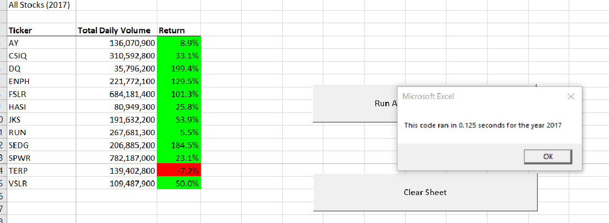
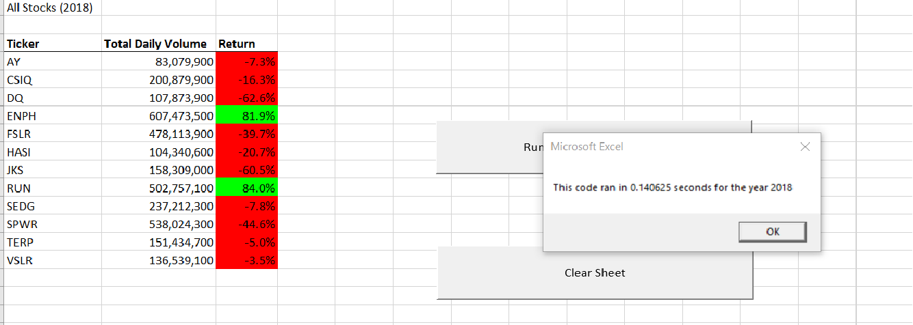

# Green Stock Analysis #

## Overview ##
### Green Stock Analysis and Code Refactor ###
This project uses a VB script to analyze various green energy companies’ stock, with the purpose of comparing it to that of 'DAQA'. It will allow stock returns, and volumes to be easily compared, by outputting the data in a labelled table. The process is made user friendly by including a button to run the macro.  The user can select which years data they wish to analyze via a pop-up input box.  A timer is included to test the speed of the macro, the code is then refactored and timed to see which version is faster

## Analysis ##

We are building a macro that will read through the data sheet, determine the name of the stock, keep a cumulative total of the volume of that stock, find a *startingPrice* based on the closing price on the first entry by date and an *endingPrice* based on the closing price of the last entry by date. This is helped by the data already being sorted.
Our first attempt creates an array of tickers 0 through 11, one per stock.  It then determines the total row count and runs a second nested loop through all the rows.  As it proceeds row by row it checks the ticker value, keeps a cumulative total for volume for the ticker, and checks if it is the first or last instance of that stock. **It runs through every ticker value on every row.**Data is output on a sheet which is formatted for ease of reading with headers and conditionals that change the color of a cell red or green based on negative or positive returns. A button was added to launch the macro, and an input box allows the user to select a data set by year.

### Refactoring ###
The refactoring retains all the functionality. To improve the code, it has been reshaped. Instead of using nested for loops, it makes use of the fact that the data sets are ordered and uses a *tickerIndex* which increases by one every time the Ticker Cell changes. This *tickerIndex* value moves us though our array of tickers.   We no longer loop through the whole ticker array on each row. 

We set timers in each macro to test for speed.
 
[Refactored Code](VBA_Challenge.vbs)

## Summary ##

## Results of stock analysis ##
From using our macro we can see that "DQ" may not be the best investment. It was the top performer in 2017, but in 2018 it did not fare well. "DQ" returns in 2018 were -62.6%.  A better option may be "ENPH" (81.9%) or "RUN" (84%). 

### Advantages and disadvantages of refactoring code. 
Refactoring code can improve the design of existing code. Code can become easier to read, unnecessary complexity can be removed, bugs can be found.  Better code structure means the code can be, fixed easier(maintainability), reused, and is a better base for future expansion(extensibility).  It can also increase performance speed of code.
The main disadvantage is that it takes time to do.  Projects with short deadlines may not be suitable for refactoring.

### Original VBA script vs Refactored VBA script.

The refactored VBA script is considerably faster than the original. This would become even more important with larger datasets, especially if we added more tickers.  The initial code used a nested loop that looped through all the tickers and all the rows--checking every row for every ticker.  The refactored code sped this process up by utilizing the *tickerIndex* to move through the arrays of tickers.  The *tickerIndex* increases as it detects the next row belonging to a different ticker, as the data is in order we only need to go through the rows once. The original code ran in ~0.5 seconds where the refactored took ~0.15 seconds.
 
 Speed test for refactored code for "2017" and "2018"

 
 

